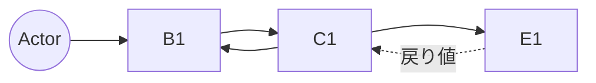

> **DEPRECATED**: 本テンプレートは SCP では使用しない。RB/SEQ は抽象側 (RBA/SEQA) と具体側 (RBD/SEQD) に二段化された。代わりに以下を参照:
>
> - 抽象 RB → `RBA-template.md` (ドメインレベル)
> - 抽象 SEQ → `SEQA-template.md` (ドメイン主語の交互作用)
> - 具体 RB → `RBD-template.md` (クラス図レベル、操作名は人間の言語)
> - 具体 SEQ → `SEQD-template.md` (クラスインスタンス間メッセージング)
>
> 詳細は `04-iconix-layer.md` を参照。本ファイルは旧プロセス参照用として残置。

---

Document ID: RB-<AREA>-NNN

# RB-<AREA>-NNN: <UC タイトルに対応する構造図>

**親 UC**: UC-<AREA>-MMM

## 1. オブジェクト一覧

### 1.1 Boundary（B）
アクターとシステムの境界（UI 要素 / 外部 API クライアント / CLI / メッセージング受口など）

| ID | 名称 | 役割 |
|---|---|---|
| B1 | <名称> | <役割> |
| B2 | <名称> | <役割> |

### 1.2 Control（C）
振る舞いの制御ロジック

| ID | 名称 | 役割 |
|---|---|---|
| C1 | <名称> | <役割> |

### 1.3 Entity（E）
永続化される/されるべきデータ

| ID | 名称 | 役割 |
|---|---|---|
| E1 | <名称> | <役割> |

## 2. 通信フロー

## 3. 通信制約遵守チェック

- [ ] Actor → Boundary 以外の直接通信なし
- [ ] Boundary 同士の直接通信なし
- [ ] Entity 同士の直接通信なし
- [ ] Boundary → Entity 直結なし
- [ ] 上記が破れている場合、責任分離が崩れていないか UC レベルで再確認

## 4. 代替フロー / 例外フローの構造差分

UC の代替・例外フローで通信構造が変わる場合、その差分を記述:

### 4.1 代替フロー A
- 追加 / 変更されるオブジェクト: <なし / 一覧>
- 通信フロー差分: <なし / 図>

### 4.2 例外フロー X
- 巻き戻し対象 Entity: <一覧>
- ユーザ通知 Boundary: B<番号>

## 5. 関連成果物

- 親 UC: UC-<AREA>-MMM
- 下位 SEQ: SEQ-<AREA>-NNN
- 関連 ADR（責任分離・境界設計）: ADR-<AREA>-XXX
