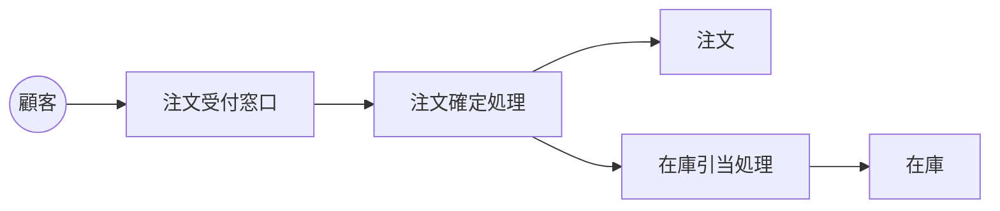

Document ID: RBA-<AREA>-NNN

# RBA-<AREA>-NNN: <UC タイトルに対応するドメイン構造図>

**親 UC**: UC-<AREA>-NNN
**レイヤ**: 抽象側(ドメインレベル、言語非依存)

> **記述規律**: ドメイン語彙のみ。クラス境界・属性・操作は書かない。Boundary/Control/Entity の役割識別と通信制約遵守のみ。詳細は `04-iconix-layer.md` §3。

---

## ドメイン主語

UC から抽出した主語(概念名のまま、クラス名にしない):

### Boundary 役割の主語

- <ドメイン主語名>: <責務、自然言語>
- 例: 「注文受付窓口」「外部決済プロバイダ」「ユーザー画面」

### Control 役割の主語

- <ドメイン主語名>: <責務、自然言語>
- 例: 「注文確定処理」「在庫引当処理」

### Entity 役割の主語

- <ドメイン主語名>: <責務、自然言語>
- 例: 「注文」「在庫」「顧客」

## 主語間の関係(概念レベル)

ドメインの関係を自然言語で記述する。カーディナリティや composition/aggregation の意味付けは具体側(RBD)で行う。

- 「注文は顧客に紐付く」
- 「注文確定処理は在庫に問い合わせる」

## 通信フロー(ドメインレベル)

主語の名前はドメイン語彙、クラス名命名規則(PascalCase 等)は使わない。

## 通信制約遵守チェック

- [ ] Boundary 同士の直接通信なし
- [ ] Entity 同士の直接通信なし
- [ ] Boundary → Entity 直結なし
- [ ] Actor → Control / Entity 直結なし

違反があれば UC レベルに戻って責任分離を再検討する。
