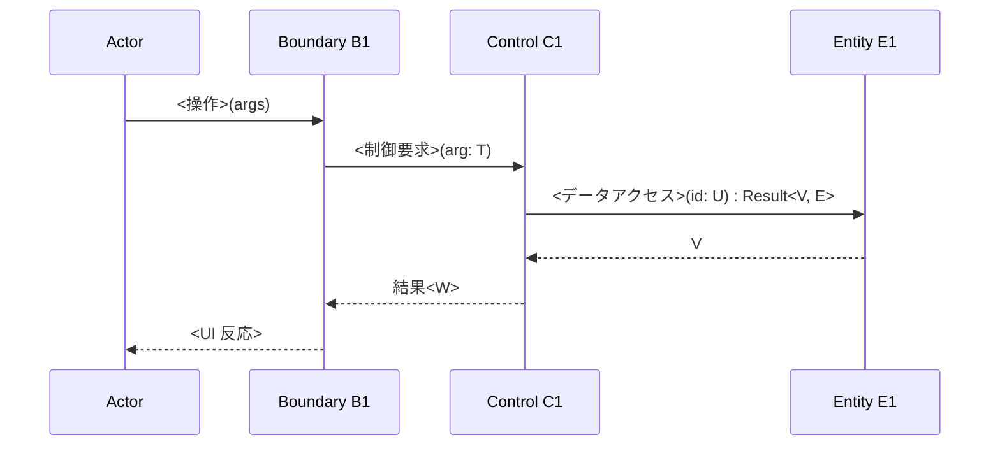
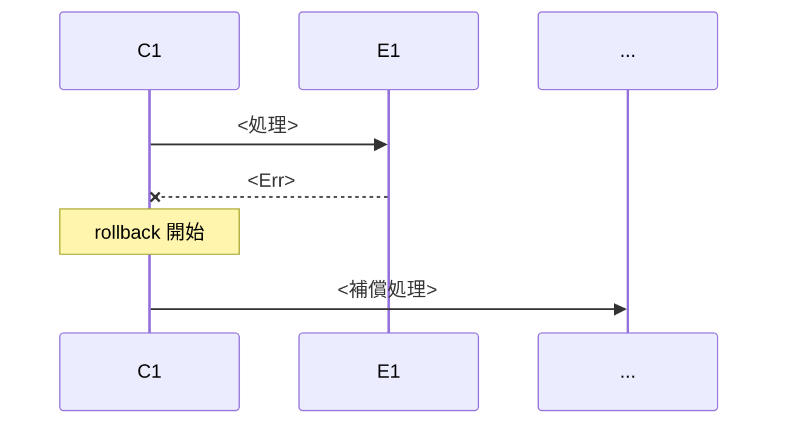
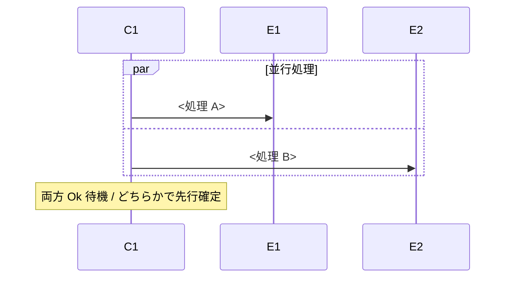

> **DEPRECATED**: 本テンプレートは SCP では使用しない。RB/SEQ は抽象側 (RBA/SEQA) と具体側 (RBD/SEQD) に二段化された。代わりに以下を参照:
>
> - 抽象 RB → `RBA-template.md` (ドメインレベル)
> - 抽象 SEQ → `SEQA-template.md` (ドメイン主語の交互作用)
> - 具体 RB → `RBD-template.md` (クラス図レベル、操作名は人間の言語)
> - 具体 SEQ → `SEQD-template.md` (クラスインスタンス間メッセージング)
>
> 詳細は `04-iconix-layer.md` を参照。本ファイルは旧プロセス参照用として残置。

---

Document ID: SEQ-<AREA>-NNN

# SEQ-<AREA>-NNN: <UC タイトル>

**親 RB**: RB-<AREA>-MMM
**親 UC**: UC-<AREA>-MMM（参照）

## 1. 基本フロー



### 各メッセージの仕様

| # | 送信元 | 送信先 | 種別 | 引数（型）| 戻り値（型）| 同期/非同期 |
|---|---|---|---|---|---|---|
| 1 | Actor | B1 | <操作名> | <型> | (なし) | 同期 |
| 2 | B1 | C1 | <制御要求名> | <型> | <Result<V, E>> | 同期 |
| 3 | C1 | E1 | <DB アクセス名> | <id: U> | <V> | 非同期 |
| ... | ... | ... | ... | ... | ... | ... |

## 2. 代替フロー A: <分岐条件>

UC §<番号> 代替 A に対応。基本フロー §<番号> から分岐:

```mermaid
sequenceDiagram
    ...
```

## 3. 例外フロー X: <失敗状況>

UC §<番号> 例外 X に対応:



### ロールバック / 補償の保証

- どの状態に巻き戻すか
- 副作用の解放順序
- ユーザ通知（Boundary 経由）

## 4. 並行 / ループ

並行・ループブロックを明示する。各ブロックの境界とイベント条件を記述。



## 5. タイムアウト / リトライ

| メッセージ | タイムアウト | リトライ方針 |
|---|---|---|
| #N | <値> | <なし / N 回 / 指数バックオフ> |

## 6. 関連成果物

- 親 RB: RB-<AREA>-MMM
- 下位 DD: DD-<AREA>-NNN
- 関連 NFR（性能）: NFR-<AREA>-XXX
