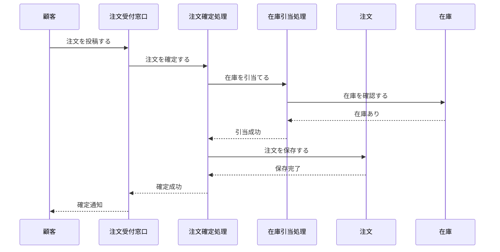
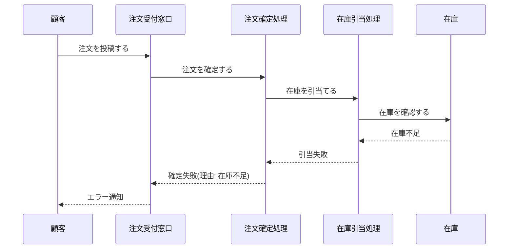

Document ID: SEQA-<AREA>-NNN

# SEQA-<AREA>-NNN: <UC タイトルに対応するドメイン相互作用>

**親 RBA**: RBA-<AREA>-NNN
**親 UC**: UC-<AREA>-NNN
**レイヤ**: 抽象側(ドメインレベル、言語非依存)

> **記述規律**: RBA で識別したドメイン主語をレーンとして、UC のフロー(基本/代替/例外)を時系列で展開する。メッセージは自然言語(ドメイン語彙)で書く。関数名・API 名・引数型は書かない。詳細は `04-iconix-layer.md` §4。
>
> **原典 ICONIX の規律(Rosenberg & Stephens 2007)**: UC text を本ファイルの左側または冒頭に並列配置することで、UC ⇄ SEQA の整合性を視覚的に維持する。どちらかが修正されたとき、もう一方も同期更新する規律が働く。

---

## UC text(並列配置)

以下は UC-<AREA>-NNN のテキストをコピー貼り付けしたもの。SEQA のメッセージと 1 対 1 で対応する。

```
[UC-<AREA>-NNN の基本フローの番号付きテキストをここに貼り付け]
1. 顧客が注文を投稿する
2. 注文受付窓口が注文確定処理に依頼する
3. 注文確定処理は在庫引当処理に在庫確認を依頼する
4. 在庫引当処理は在庫を確認する
5. 在庫が確認できれば注文を保存する
6. 確定通知を顧客に返す
```

## 基本フロー



メッセージは自然言語のまま。`place_order()` のような関数呼び出し表記は使わない。

## 代替フロー

<UC の代替フローに対応するシーケンス>

## 例外フロー

### 例外: 在庫不足



### 例外: <他の例外>

## 並行性(概念レベル、ある場合のみ)

ドメインレベルで並行に発生する事象は時系列として記述する。具体的な並行機構(`async/await`, goroutine, thread)は DD で確定。

- 例: 「在庫引当処理と支払い処理は並行に進行する」

## 整合性確認

- [ ] 各メッセージがドメイン語彙で書かれている(関数名・API 名なし)
- [ ] レーンが RBA の主語と一致する(クラス名が混入していない)
- [ ] UC の基本/代替/例外フローを網羅している
