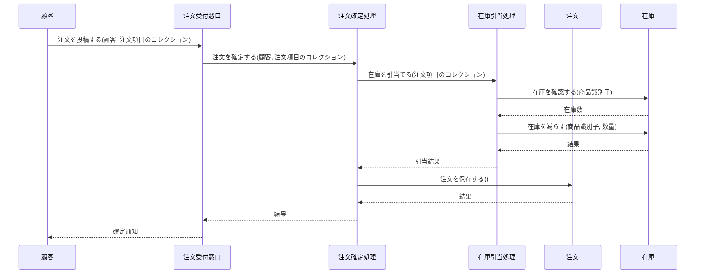
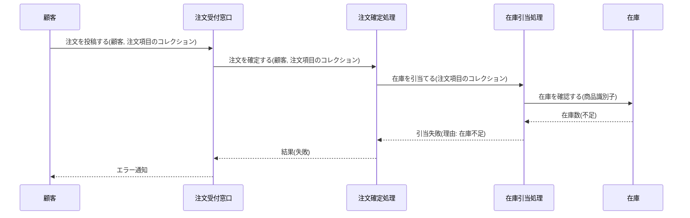

Document ID: SEQD-<AREA>-NNN

# SEQD-<AREA>-NNN: <UC タイトルに対応するクラス間メッセージング>

**親 RBD**: RBD-<AREA>-NNN
**レイヤ**: 具体側(クラス図レベル、言語非依存)

> **記述規律**: RBD で識別したクラスをレーンとして、操作呼び出し時系列を描く。**操作呼び出しは操作名(人間の言語)**。関数名・引数型・戻り型・言語固有同期機構は書かない。詳細は `04-iconix-layer.md` §6。
>
> **ハードルール 10**: 関数名(snake_case/camelCase の呼び出し)、`async fn`、`Result<T,E>` 表記、`tokio::spawn`、`Promise.all` などが本ファイルに混入したら違反。`scripts/trace-check.sh` がレイヤ汚染検査で検出する。

---

## 基本フロー



メッセージは「操作名(引数概念名)」の形式。`place_order(customer: &Customer, items: Vec<Item>)` のような言語固有表記は使わない。

## 代替フロー

<UC の代替フローに対応するシーケンス>

## 例外フロー

### 例外: 在庫不足



戻り値は「結果(失敗、理由)」のような概念表現。`Result::Err(...)` のような言語固有表記は使わない。

### 例外: <他の例外>

## 並行性(概念レベル)

具体側でも並行性は概念表現に留める。具体機構(`async fn`, goroutine, thread)は DD で確定。

```
note: 在庫引当処理と支払い処理は並行に進行する(<<concurrent>>)
```

## 失敗伝搬

操作の戻り値に「結果」概念で表現。具体的なエラー型(`Result<T, OrderError>`, `Either[E, T]`, `error`)は DD で確定。

## 整合性確認

- [ ] レーンが RBD のクラスと一致する
- [ ] 操作呼び出しが RBD で識別した操作と対応する
- [ ] 関数名(言語命名規則)が混入していない
- [ ] 引数型・戻り型(言語固有)が混入していない
- [ ] 言語固有同期機構の表記が混入していない

## レイヤ汚染チェック

- [ ] `place_order(`, `placeOrder(` のような関数呼び出しが含まれていない
- [ ] `Result<T, E>`, `Vec<T>`, `Option<T>` のような型表記が含まれていない
- [ ] `async`, `await`, `tokio::spawn`, `Promise.all` などが含まれていない
- [ ] crate/package 識別子(`tokio::`, `std::`)が含まれていない

違反が見つかったら、該当箇所を DD に移動する。
